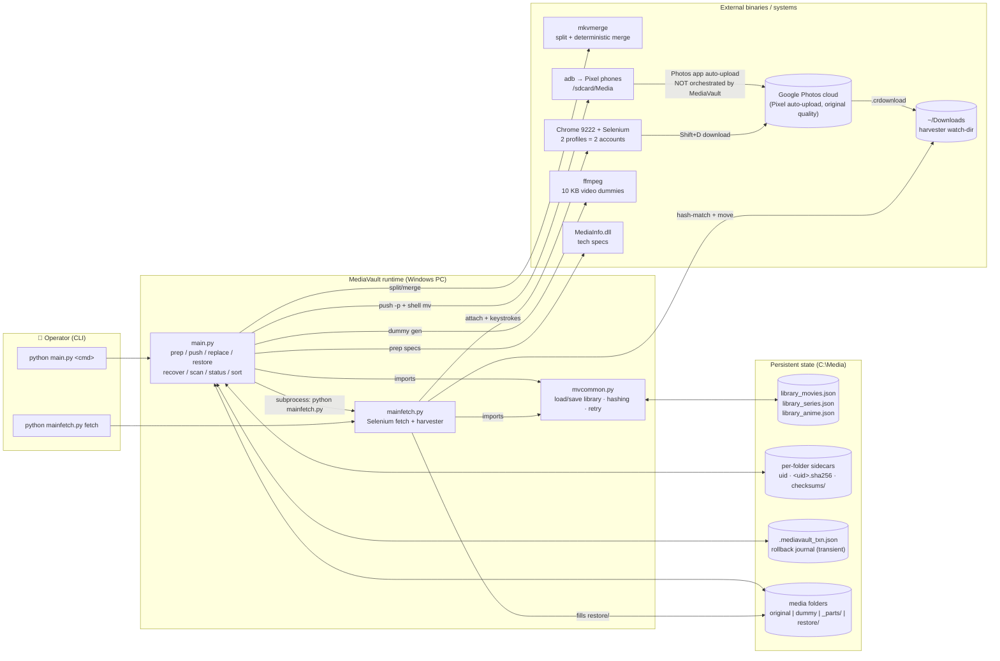
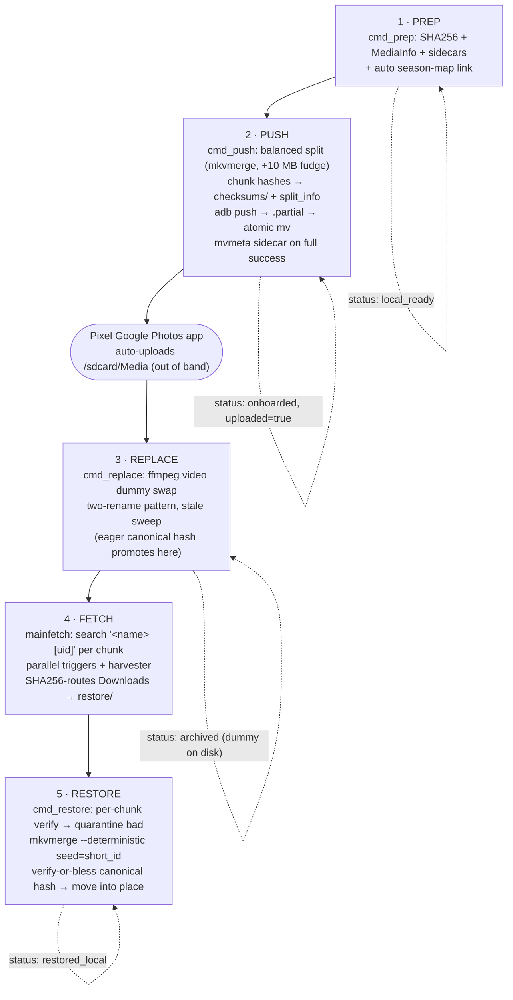
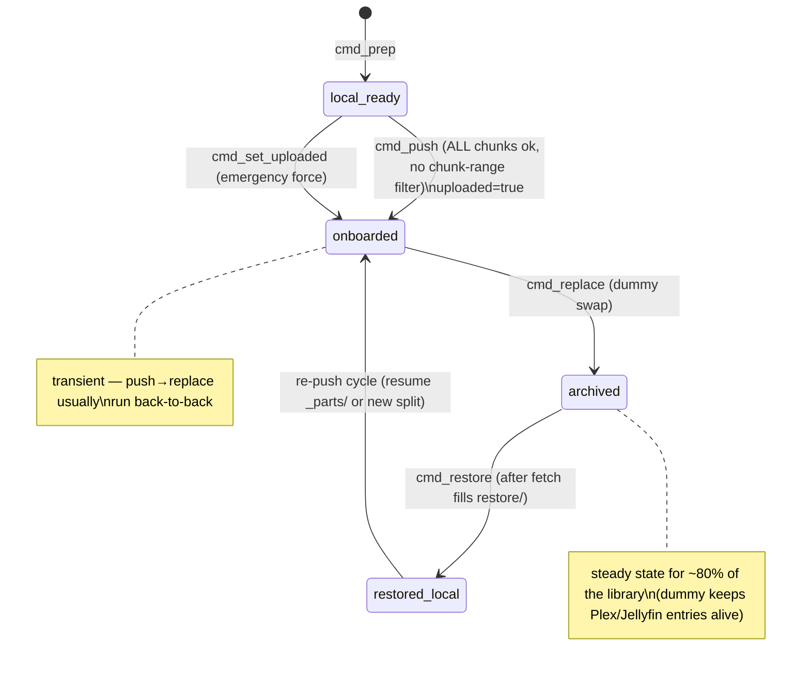
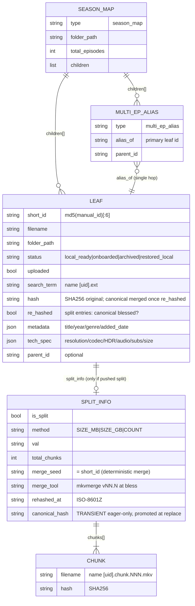
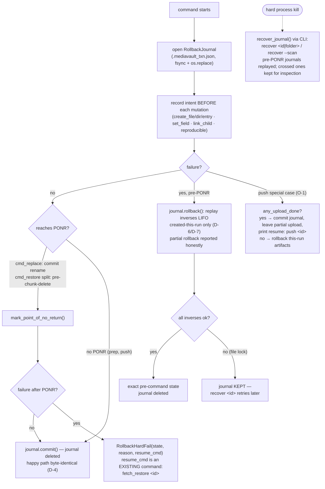
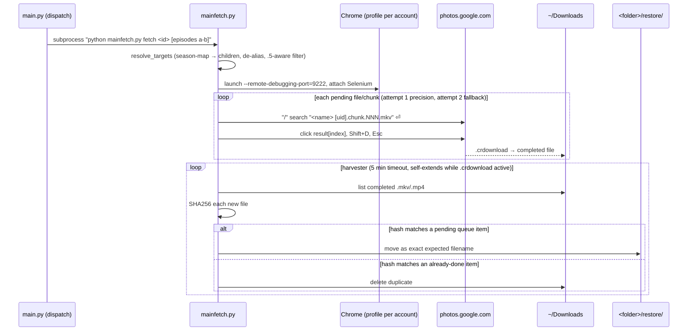
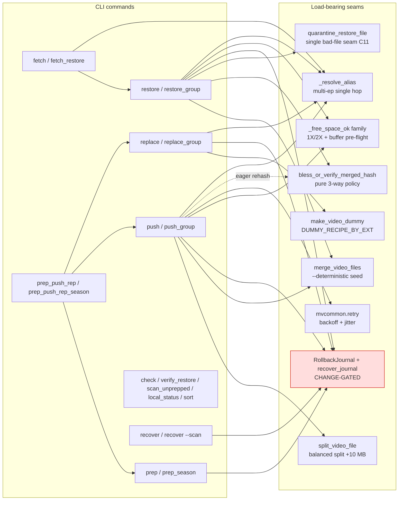

# MediaVault — Architecture Graph Views

Graph renditions of [`ARCHITECTURE.md`](ARCHITECTURE.md), generated by the 2026-06-12 fable-review
session and kept in sync with the code at that date. GitHub renders the Mermaid blocks inline.
An **interactive** (pan/zoom/search/filter, graphify-style) version of the full dependency graph lives at
[`docs/architecture-graph/graph.html`](docs/architecture-graph/graph.html) — open it in any browser.

---

## 1. System overview — components and externals

## 2. The five-stage lifecycle (happy path)

## 3. Entry status state machine

## 4. Data model — entry types and relations

## 5. Auto-rollback decision flow (per wrapped command)

## 6. Fetch & harvest sequence

## 7. Command → function → seam map (who touches what)

---

*Generated 2026-06-12 against `main.py` 3081 / `mainfetch.py` 491 / `mvcommon.py` 168 lines.
Update these diagrams whenever a PR changes commands, entry schemas, PONR placement, or the seam list.*
