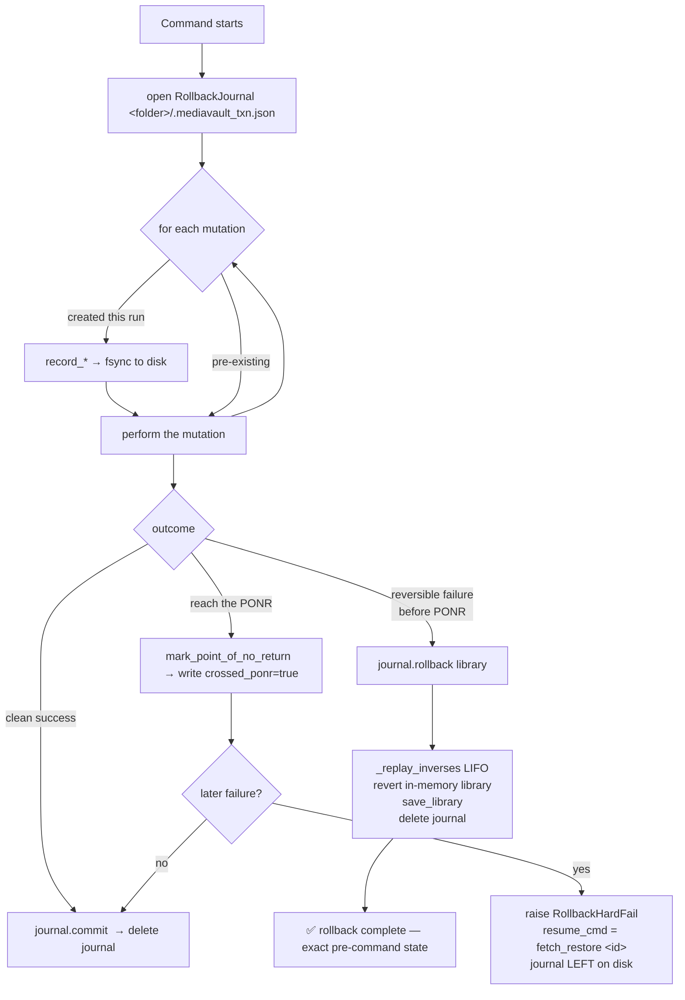
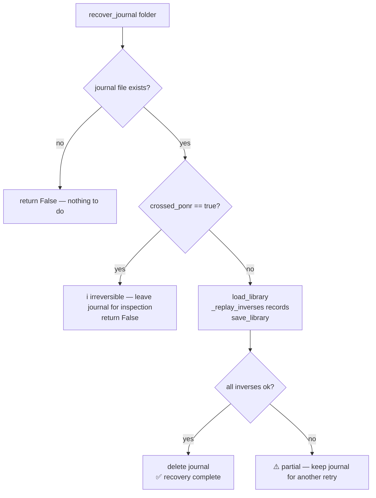

# Auto-Rollback Mechanism — How It Works

> **Authoritative deep-dive for the unified failure-handling mechanism.**
> Summary lives in [`ARCHITECTURE.md` §12a](../../ARCHITECTURE.md); the decision
> record is [`DECISIONS.md`](DECISIONS.md) (N-6) and the bake-off comparison is
> [`rollback-architecture/DECISION.md`](rollback-architecture/DECISION.md).
> **Implemented** — Candidate **C (on-disk operation journal)**, selected by the
> user wholesale for all operations. Code: `main.py`. Tests:
> `tests/test_rollback.py`.
>
> ⚠️ **This mechanism is load-bearing and change-gated.** Any task that would
> alter it MUST pause and ask the user first — see [§10 Change-gate](#10-change-gate-read-before-editing-rollback).

---

## 1. What & why

MediaVault's multi-step commands (`prep → push → replace`, the
`prep_push_rep` / `prep_push_rep_season` orchestrators, and the
`fetch → restore` side) can fail half-way. Before this feature, two ad-hoc paths
disagreed (one deleted `_parts/` and printed a "local_ready" message; the other
just `break`'d "to prevent mess"), leaving undocumented half-finished states.

Auto-rollback replaces both with **one** mechanism:

- A failure **before** a command's point-of-no-return (PONR) **auto-rolls-back**
  to the exact pre-command state — removing only what *this run* created.
- A failure **at/after** the PONR **hard-fails** with an actionable message
  naming an *existing* resume command (never a new "fetch-to-fix" command, never
  a fake/partial rollback).
- A **batch/season** failure keeps completed items and prints exactly how to
  resume the rest.
- The **happy path is byte-for-byte identical** (D-4) — commands are *wrapped*,
  not rewritten.

---

## 2. The core idea — journal-before-act

The mechanism is a **durable on-disk operation journal**. Each command opens a
journal for the (folder, id) it operates on, and **records each intended mutation
BEFORE performing it**. Because the record is fsync'd to disk first, a crash at
*any* instant — even a hard process kill or power loss — leaves a complete,
replayable list of inverses on disk. A later `recover_journal()` call can finish
an interrupted rollback. This durability is the property that distinguished the
chosen design (Candidate C) from the two in-memory alternatives (A: a transaction
context-manager; B: a compensating-action stack), whose undo plan dies with the
process.

Key classes/functions in `main.py`:

| Symbol | Line | Role |
|---|---|---|
| `TXN_JOURNAL_NAME` (`.mediavault_txn.json`) | ~395 | the journal filename written into the media folder |
| `class RollbackHardFail(Exception)` | ~398 | structured post-PONR failure: `(state, reason, resume_cmd)` |
| `class RollbackJournal` | ~410 | one journal per command-per-id; `record_*`, `mark_point_of_no_return`, `rollback`, `commit` |
| `_replay_inverses(records, library)` | ~519 | applies each record's inverse LIFO (the single audit point) |
| `recover_journal(folder_path)` | ~561 | crash-recovery entry point — finishes an interrupted rollback |

---

## 3. The journal file format

`<media-folder>/.mediavault_txn.json` — a small JSON document, rewritten durably
(write-temp → `fsync` → `os.replace`) on every append:

```json
{
  "manual_id": "ani-ja-2013-aot-s04e05",
  "crossed_ponr": false,
  "records": [
    {"op": "create_dir",   "path": "C:\\Media\\Anime\\…\\_parts"},
    {"op": "create_dir",   "path": "C:\\Media\\Anime\\…\\checksums"},
    {"op": "set_field",    "id": "ani-…e05", "field": "split_info", "existed": false, "prior": null}
  ]
}
```

The record vocabulary is a **small fixed set**, each with a known inverse:

| Record `op` | Forward action it precedes | Inverse on rollback |
|---|---|---|
| `create_file` | write a sidecar (`uid`, `<short_id>.sha256`) | `os.remove` if it exists |
| `create_dir` | `os.makedirs(_parts/ or checksums/)` | `shutil.rmtree` if it exists |
| `create_entry` | add `library[id]` | `library.pop(id)` |
| `set_field` | set a field (e.g. `split_info`) | restore `prior` if it existed, else pop the field |
| `link_child` | add child to a parent `season_map` | unlink child; delete parent **only if** this run created it AND it's now childless (D-7), else recompute `total_episodes` |
| `create_reproducible` | write a regenerable output (merged restore target) | `os.remove` (it can be rebuilt from surviving inputs) |

> **Created-this-run scoping (D-6).** A record is written **only if the artifact
> did not already exist** at command entry. A *resume* `_parts/` (left by a prior
> interrupted push) gets **no** `create_dir` record, so rollback never deletes it.
> This is what makes resume/re-run safe.

---

## 4. Command lifecycle



- **`rollback(library)`** refuses to run once `crossed_ponr` is set (a post-PONR
  caller must raise `RollbackHardFail` instead). If an inverse fails (e.g. a
  Windows file lock), it reports a **partial rollback honestly**, still saves the
  library reverts that succeeded, and **keeps the journal** so recovery can retry.
- **`commit()`** simply deletes the journal — a committed run needs no undo.

---

## 5. Points of no return (PONR)

The master/original video is the source of truth: while it exists on disk the
operation is reversible. It is destroyed in **exactly two** places.

| Command | PONR | Failure handling |
|---|---|---|
| `cmd_prep` | **none** — fully reversible | auto-rollback this-run entry/sidecars/parent-link (early-skips create nothing and never roll back) |
| `cmd_push` | **none (O-1)** — resumable | **resume-message**: leave the partial upload, entry stays `local_ready`/`uploaded=False`, print `push <id>`. Roll back this-run `_parts`/`checksums`/`split_info` **only if** created this run AND failure is *pre-any-upload*. A pre-existing/resume `_parts/` is never deleted |
| `cmd_replace` | **commit rename** `os.rename(original → .tobedeleted)` | pre-PONR: roll back the dummy temp. At/after: `RollbackHardFail` → `fetch_restore <id>`. C9 stale-sweep self-heals a torn crash on the next `replace` |
| `cmd_restore` (split) | **merged-chunk delete from `restore/`** | pre-PONR: reuse C11 `quarantine_restore_file` + reproducible-output cleanup. At/after: `RollbackHardFail` → `fetch_restore <id>`. Standard (non-split) path is a single `shutil.move` — no torn window |

**O-1** (push = resume-message) and **O-2** (the two true PONRs) are the resolved
boundary decisions — see [`DECISIONS.md`](DECISIONS.md). After either PONR the
bytes are only in the cloud / need a re-fetch, so the hard-fail names the existing
`fetch_restore <id>` pipeline. No new command is invented (N-2).

---

## 6. Per-command behavior

- **`cmd_prep`** — no PONR. Journal opened; each sidecar / parent-link / entry is
  recorded before it's created (created-this-run guards skip pre-existing). Any
  failure (hash failure, unexpected exception) → `rollback`. Early-skips (already
  uploaded/archived, or sub-`DUMMY_MAX_BYTES` dummy) return `True` before anything
  is created → nothing to roll back.
- **`cmd_push`** — no rollback PONR (O-1). Records `create_dir` for
  `_parts/`/`checksums/` and `set_field split_info` only if not pre-existing.
  `any_upload_done` flips after the first successful chunk upload+rename: a failure
  *before* it rolls back this-run split artifacts; a failure *after* it
  `commit()`s the journal and prints the `push <id>` resume-message (the partial
  upload is now legitimate resumable state).
- **`cmd_replace`** — PONR at the commit rename; the dummy temp is the only
  pre-PONR artifact. `mark_point_of_no_return()` fires right after the rename; a
  later failure → `RollbackHardFail`. C9's stale-sweep is left intact.
- **`cmd_restore`** (split) — the merged target is recorded as `create_reproducible`
  before merging, so a merge failure removes it and keeps the chunks for a re-merge;
  C11 quarantine is reused for a corrupt chunk. `mark_point_of_no_return()` +
  `commit()` fire before the chunk delete. Standard path unchanged.
- **Orchestrators** — `cmd_prep_push_rep` drops the ad-hoc cleanup and relies on
  the wrapped `cmd_push` (O-1) and `cmd_replace` (catches `RollbackHardFail`).
  `cmd_prep_push_rep_season` keeps completed episodes, lets the in-flight item
  self-handle, and prints a reconstructed **resume-range** command (`SIZE_*` /
  `device` / `episodes`, handling a `.5` episode). Messaging only — no progress-file
  dependency (C1 is not merged).

---

## 7. Crash recovery — `recover_journal(folder_path)`



`recover_journal()` is **not** on the happy path (D-4) — it's an explicit
entry point. A journal that crossed its PONR is deliberately left untouched (the
command committed irreversibly; there is nothing to undo).

---

## 8. Every failure scenario at a glance

| # | Scenario | Trigger | Outcome |
|---|---|---|---|
| 1 | `prep` fails | hash/sidecar/parent error | rollback: remove this-run `uid`/`.sha256`/entry/parent-link; "rollback complete" |
| 2 | `push` split fails pre-upload | mkvmerge fails / first `adb push` fails, `any_upload_done=False` | rollback: rmtree this-run `_parts/`+`checksums/`, pop `split_info`; master + `local_ready` entry intact |
| 3 | `push` fails mid-upload | chunk N>1 fails, `any_upload_done=True` | **no rollback** — leave partial upload, print `push <id>` (O-1) |
| 4 | `push` resume | pre-existing `_parts/`, then a failure | pre-existing artifacts never recorded → never deleted |
| 5 | `replace` fails pre-PONR | dummy gen / first rename throws before commit rename | rollback: delete the dummy temp; original in place |
| 6 | `replace` fails at/after PONR | commit rename done, later step throws | `RollbackHardFail` → `fetch_restore <id>`; C9 guarantees bytes at `.tobedeleted` |
| 7 | `restore` split fails pre-PONR | corrupt chunk / merge fail | C11 quarantine; drop the reproducible target, keep chunks |
| 8 | `restore` split fails at/after PONR | chunks already deleted from `restore/` | `RollbackHardFail` → `fetch_restore <id>` (needs re-fetch) |
| 9 | season batch fails | one episode fails mid-run | completed episodes stay; in-flight self-handles; print resume-range command |
| 10 | **hard kill mid-command** | power loss / SIGKILL / SystemExit | in-process `except` never runs; journal survives → `recover_journal()` finishes cleanup |
| 11 | **hard kill mid-rollback** | killed during `_replay_inverses` | journal still on disk (deleted only at the end) → `recover_journal()` replays the *remaining* inverses |
| 12 | file lock during rollback | Plex/Windows Search holds a chunk | partial-rollback reported honestly; journal kept; `recover_journal()` retries later |

Scenarios 1–9 behave identically regardless of mechanism; **10–12 are where the
durable journal earns its place** — the test
`tests/test_rollback.py::test_journal_survives_hard_kill_and_recovers` proves #10/#11.

---

## 9. Storage characteristics

**Rollback duplicates zero media bytes.** Its strategy is *delete what this run
created*, not *keep a backup to restore from*. So it adds essentially nothing to
the existing transient footprint.

Worked example — a **20 GB** file split into **4 × 5 GB** chunks:

```
existing peak during push:  20 GB original  +  4 × 5 GB chunks in _parts/  =  ~40 GB
                            (chunks are deleted one-by-one as each uploads)
```

What auto-rollback adds **on top of that**:

| | Extra disk | Extra RAM | Copies media bytes? |
|---|---|---|---|
| Journal (`.mediavault_txn.json`) | **~a few hundred bytes** — for this push, 3 records (2× `create_dir` + 1× `set_field`) + a transient same-size `.tmp` during each fsync | negligible | **No** |

Why it stays tiny even for huge files: the journal records the **`_parts/`
directory** (one `create_dir`), not each chunk — a 20 GB or 200 GB file is still
~3 records. `set_field` stores only small prior *metadata* values, never bytes.

On a **failure**, rollback `rmtree`s `_parts/` and **frees** the ~20 GB of chunks —
so it reclaims space rather than consuming it (and is cleaner than the old ad-hoc
path that sometimes left `_parts/` behind).

> The ~40 GB transient peak is a property of the **split-then-upload** design, not
> of rollback. Reducing it (stream split-upload-delete) is tracked separately as
> **IMP-R1** in [`improvements_tierR.md`](../../improvements/improvements_tierR.md).

---

## 10. Change-gate (READ before editing rollback)

This mechanism is **load-bearing** and was chosen via a user-decided bake-off
(`DECISIONS.md` N-6). **Any task that would change its behavior MUST pause before
implementing, state exactly what differs from the behavior documented here, and
ask the user as an explicit decision.** Do not silently modify it.

"Affecting rollback" includes any change to:

- the journal format / record vocabulary / `TXN_JOURNAL_NAME` or its durability
  (`fsync` + `os.replace`);
- the **point-of-no-return** locations or the `mark_point_of_no_return()` placement
  in `cmd_replace` / `cmd_restore`;
- **what is snapshotted/recorded** (the created-this-run scoping, D-6/D-7 rules);
- the **wrapping** of `cmd_prep` / `cmd_push` / `cmd_replace` / `cmd_restore`, or
  the O-1 resume-message vs O-2 hard-fail split;
- `recover_journal()` semantics (including that it is *not* on the happy path);
- the **season resume-range** messaging in `cmd_prep_push_rep_season`;
- the `RollbackHardFail` contract (`resume_cmd` must name an existing command).

This rule is also recorded in the project [`CLAUDE.md`](../../CLAUDE.md) so every
session and sub-agent sees it.

---

## 11. Code & test map

- Mechanism: `main.py` — `RollbackHardFail` (~398), `RollbackJournal` (~410),
  `_replay_inverses` (~519), `recover_journal` (~561).
- Wrapping: `cmd_prep` (~599), `cmd_push` (~992), `cmd_replace` (~1335),
  `cmd_restore` (~1598), `cmd_prep_push_rep` / `cmd_prep_push_rep_season` (~2010 /
  ~2048). Line numbers verified against the merged branch; treat names as canonical
  if they drift.
- Tests: `tests/test_rollback.py` (full scenario matrix incl. the durable-journal
  crash-recovery test) + `tests/test_baseline_happy_path.py` (the D-4 happy-path
  oracle). `pytest -q` → 67 passed, 1 ffmpeg-gated skip.
